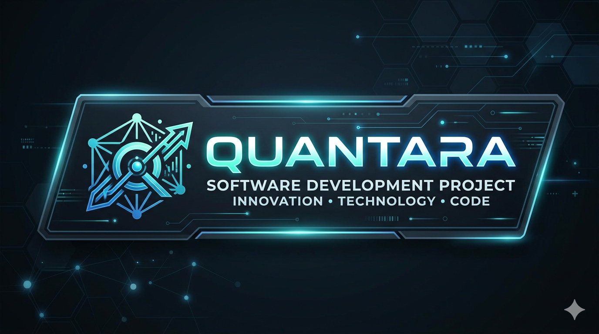
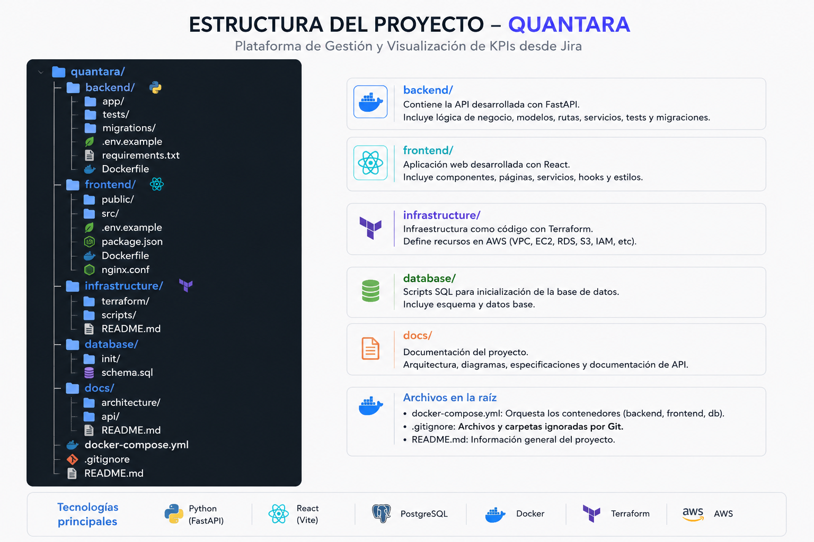

<p align="center">
  
</p>

<h1 align="center">🚀 QUANTARA</h1>

<p align="center">
Plataforma inteligente para KPIs de desarrollo
</p>


Plataforma inteligente para gestión y visualización de KPIs de equipos de desarrollo mediante integración con Jira Cloud.

<h1 align="center">📌 Descripción</h1>

QUANTARA es una plataforma web desarrollada para automatizar el cálculo, almacenamiento y visualización de KPIs de equipos de desarrollo utilizando la API REST de Jira Cloud.

El sistema permite transformar datos técnicos en información estratégica mediante dashboards interactivos, métricas automatizadas y reportes inteligentes para líderes de proyecto y directivos.

<h1 align="center">🎯 Objetivo</h1>

Centralizar el análisis de productividad y desempeño de equipos de desarrollo mediante métricas obtenidas desde Jira usando consultas JQL y procesamiento automatizado de datos.

<h1 align="center">⚡ Características Principales</h1>

✅ Integración con Jira Cloud API v3
✅ Consultas dinámicas usando JQL
✅ Dashboards interactivos en tiempo real
✅ Cálculo automático de KPIs
✅ Autenticación segura con JWT
✅ Exportación de reportes PDF
✅ Scheduler para sincronización automática
✅ Infraestructura como código con Terraform
✅ Despliegue contenerizado con Docker
✅ Arquitectura cloud-ready sobre AWS

<h1 align="center">📊 KPIs Soportados</h1>

- Sprint Velocity
- Lead Time
- Cycle Time
- Throughput
- Reopen Rate
- Resolution Rate

<h1 align="center">🏗️ Arquitectura General</h1>

<p align="center">
  
</p>

<h1 align="center">🛠️ Stack Tecnológico</h1>

- Backend: Python + FastAPI
- Frontend: React + TypeScript
- Database: PostgreSQL
- Cloud: AWS
- IaC: Terraform
- Containers: Docker
- Charts: Chart.js
- Auth: JWT
- Version Control: Git + GitHub

<h1 align="center">🔐 Seguridad</h1>

- Autenticación basada en JWT
- Control de acceso por roles
- Variables de entorno seguras
- Protección de rutas en frontend
- Arquitectura desacoplada

<h1 align="center">👥 Roles del Sistema</h1>

- Admin: Gestión completa del sistema
- Manager: Visualización y análisis de KPIs
- Developer: Consulta de métricas individuales

<h1 align="center">🚀 Instalación</h1>

<h1 align="center">1️⃣ Clonar repositorio</h1>

```bash
git clone https://github.com/kamiloo1/QUANTARA.git
cd QUANTARA
```

<h1 align="center">2️⃣ Variables de entorno</h1>


Crear archivo `.env`

```text
JIRA_BASE_URL=
JIRA_EMAIL=
JIRA_API_TOKEN=
DATABASE_URL=
JWT_SECRET=
```

<h1 align="center">3️⃣ Levantar contenedores</h1>


```bash
docker-compose up --build
```

<h1 align="center">📂 Estructura del Proyecto</h1>

quantara/
│
├── backend/
├── frontend/
├── infrastructure/
├── database/
├── docs/
├── docker-compose.yml

<h1 align="center">📁 Documentación</h1>

La carpeta `Documentacion QUANTARA/` contiene la documentación adicional del proyecto, incluyendo instrucciones, diagramas y una guía de uso general.
