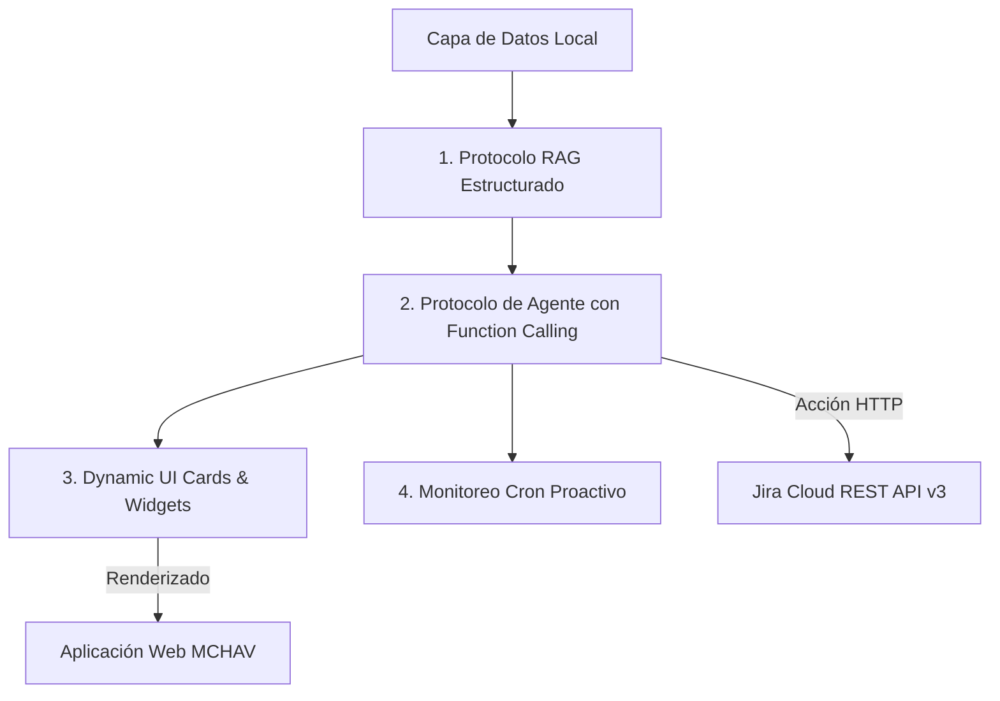

# Reporte Técnico y Ejecutivo: Gobernanza de Datos, Arquitectura y Propuestas de Valor de Inteligencia Artificial (NubI IA)

**Proyecto:** MCHAV Analytics — Plataforma de Métricas, Diagnósticos Ágiles e Inteligencia Artificial  
**Autor:** Equipo de Ingeniería y Ciencia de Datos  
**Fecha:** 2026-08-21  
**Versión Documento:** 1.0  

---

## 📋 Resumen Ejecutivo

El presente documento constituye el informe técnico y estratégico oficial sobre la integración, gobernanza de datos, arquitectura de seguridad y propuestas de valor de la Inteligencia Artificial (**NubI IA**) integrada en **MCHAV Analytics**.

La implementación de **NubI IA** (impulsada por el motor de **Google Gemini API**) transforma a MCHAV Analytics en una plataforma predictiva de alto rendimiento. En lugar de limitarse a mostrar gráficos históricos pasivos, la IA actúa como un **Senior Agile Data Scientist** que analiza en tiempo real la salud de los sprints, evalúa métricas individuales por desarrollador (*Cycle Time*, *WIP*, *Throughput*), detecta cuellos de botella y permite ejecutar acciones directamente en **Jira Cloud**.

---

## 🌟 1. Propuestas de Valor Estratégicas

### 📊 1.1 Diagnóstico Predictivo de Salud del Sprint (Predictive Sprint Health)
* **Objetivo:** Predecir desviaciones en la entrega antes de que finalice el sprint.
* **Mecanismo:** NubI IA compara la velocidad histórica de entrega (*throughput*) contra los Story Points restantes y los días hábiles disponibles.
* **Valor:** Permite al Scrum Master o Líder Técnico tomar decisiones informadas a mitad del sprint (desasignar historias de usuario complejas o reasignar recursos) para evitar el *Carryover*.

### 👤 1.2 Coach Personalizado para Desarrolladores (AI Developer Advocate)
* **Objetivo:** Optimizar la eficiencia individual sin recurrir al micro-management.
* **Mecanismo:** En la vista `Plan de Trabajo` (`DeveloperView`), la mascota **🦉 NubI IA** analiza el trabajo en progreso (WIP), identificando si un desarrollador tiene más de 3 tareas simultáneas abiertas o si acumula tiempo de ciclo prolongado en un estado específico.
* **Valor:** Incrementa el ritmo de entrega (*efficiency gain*) y reduce el estrés por multitarea.

### 📄 1.3 Generación Automática de Conclusiones para Reportes PDF
* **Objetivo:** Eliminar la redacción manual de informes ejecutivos para la alta dirección.
* **Mecanismo:** Al exportar reportes semanales o mensuales en PDF, NubI IA redacta automáticamente un diagnóstico ejecutivo consolidado resaltando el cumplimiento del compromiso (*Commitment Reliability*), variaciones de alcance (*Scope Creep*) y áreas de mejora.
* **Valor:** Ahorro de horas de trabajo en elaboración de presentaciones para comités gerenciales.

### 🛑 1.4 Resolución Automatizada de Bloqueos (Smart Blocker Resolver)
* **Objetivo:** Reducir la permanencia de tickets atascados en etapas de `In Progress`, `QA` o `Code Review`.
* **Mecanismo:** Cuando un ticket supera las 48 horas sin avances en la BD, NubI IA sugiere:
  1. La descomposición automática de la historia de usuario en subtareas ejecutables.
  2. La reasignación estratégica al integrante del equipo con mayor disponibilidad y menor Cycle Time histórico en esa tipología de tarea.

---

## 🛠️ 2. Protocolos y Métodos Técnicos de Inteligencia Artificial



### 2.1 Protocolo RAG Estructurado (Retrieval-Augmented Generation)
* **Descripción:** Extrae el contexto exacto desde la base de datos PostgreSQL local (`issues`, `sprints`, `desarrolladores`, `transiciones_estado`).
* **Ventaja:** Al alimentar a Gemini con tablas relacionales sanitizadas, la IA responde con **cero alucinaciones**, garantizando precisión numérica absoluta.

### 2.2 Protocolo de Agente con Acciones (Function Calling / Tool Use)
* **Descripción:** NubI IA posee la capacidad de no solo responder texto, sino ejecutar acciones en Jira Cloud mediante peticiones REST API v3:
  - *Transición de Estado:* Cambiar tareas de `To Do` ➔ `In Progress` ➔ `Done`.
  - *Reasignación:* Asignar responsables según disponibilidad.

### 2.3 Protocolo de Componentes Dinámicos UI (Dynamic UI Cards)
* **Descripción:** En la ventana de diálogo (AiChatModal.jsx), NubI IA renderiza componentes visuales enriquecidos:
  - Tablas estilizadas en HTML/Markdown con bordes y encabezados.
  - Indicadores semáforo de riesgo y botones de acción rápida.

### 2.4 Protocolo de Observador Proactivo (Background Cron Observer)
* **Descripción:** Un servicio en segundo plano monitorea periódicamente los KPIs clave. Si la eficiencia del flujo cae por debajo del 60%, NubI IA genera una notificación proactiva en el dashboard.

---

## 🔒 3. Modelo de Gobernanza de Datos, Privacidad y Seguridad

### 🛡️ 3.1 Las 4 Capas de Protección de Datos

1. **Control de Acceso Basado en Roles (RBAC):**
   - Toda consulta a NubI IA requiere autenticación JWT activa.
   - Las métricas expuestas están delimitadas por los permisos del proyecto asignado al usuario (`users_projects`).

2. **Minimización y Sanitización PII (Personally Identifiable Information):**
   - **Nunca se envían a la IA:** Contraseñas, API Keys, tokens de acceso ni credenciales del sistema.
   - **Payload Sanitizado:** Se envían únicamente métricas numéricas agregadas, claves de ticket (ej. `MCHAV-101`) y estados del flujo.

3. **Política de No-Entrenamiento de Google Gemini API:**
   - De acuerdo con los términos de servicio de Google Cloud y AI Studio para uso empresarial via API Key: **Google no utiliza los datos enviadas por API para entrenar sus modelos públicos**.
   - Los datos se procesan con encriptación en tránsito (**TLS 1.3 / HTTPS**) y en reposo (**AES-256**).

4. **Trazabilidad y Registro de Auditoría (Audit Trail):**
   - Cada interacción con NubI IA genera un registro de auditoría en `models.AuditLog` indicando:
     - `user_id`, `timestamp`, `project_id`, `prompt_summary`, `response_status`.

---

## ⚙️ 4. Guía de Configuración de Gobernanza

### 🛠️ A. Variables de Entorno Backend (Mchav-Backend/.env)

```env
# Configuración Oficial de la IA (Gemini Engine)
GEMINI_API_KEY=AIzaSy...
GEMINI_MODEL_NAME=gemini-flash-lite-latest

# Banderas de Gobernanza y Privacidad
AI_ANONYMIZE_PII=false         # Si es true, anonimiza nombres reales por alias (Dev-01, Dev-02)
AI_MAX_CONTEXT_TOKENS=1200     # Limite máximo de tokens de contexto adjuntados
AI_ENABLE_AUDIT_LOGS=true      # Habilita el registro de auditoría en la base de datos
```

### 💻 B. Sanitización en Backend (ai_controller.py)
- La función `_build_rich_project_context(db, project_id, user_name)` actúa como la barrera de seguridad previa al envío a la API REST de Gemini.

### 👥 C. Panel de Usuarios (AdminUsuariosView.tsx)
- Permite a los Administradores gestionar los roles (`ADMIN`, `MANAGER`, `DEVELOPER`) y asignar proyectos para controlar el alcance de visualización de cada usuario en NubI IA.

---

## 📌 5. Conclusiones y Hoja de Ruta (Roadmap)

1. **Estado Actual (Fase 1 Completada):** Conexión en tiempo real con Google Gemini API, ventana conversacional **NubI IA** con pantalla completa predeterminada, historial de chats persistente en `localStorage`, tablas formateadas y cambio de estados bidireccional en Jira Cloud.
2. **Próximo Hito (Fase 2):** Implementación de Function Calling completo para reasignación directa de tickets por orden de voz/chat.
3. **Fase 3:** Integración del bloque de conclusiones analíticas redactado por NubI IA en los archivos PDF descargables.
