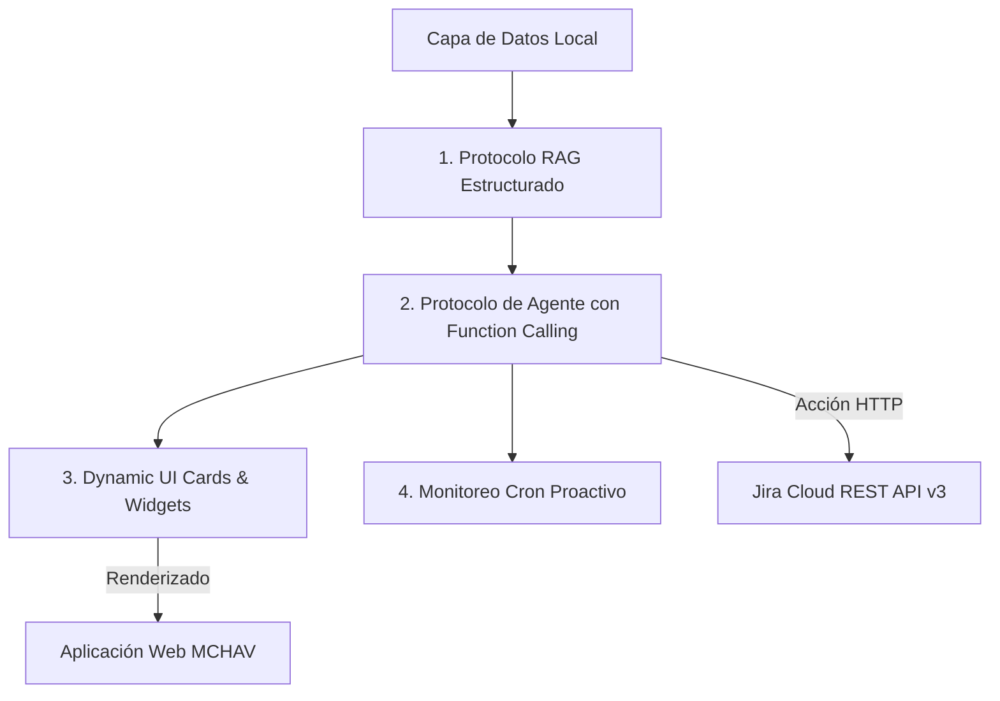

# Reporte Técnico y Ejecutivo: Gobernanza de Datos, Arquitectura, Seguridad y Estimación de Costos de Inteligencia Artificial (NubI IA)

**Proyecto:** MCHAV Analytics — Plataforma de Métricas, Diagnósticos Ágiles e Inteligencia Artificial  
**Autor:** Equipo de Ingeniería y Ciencia de Datos  
**Fecha:** 2026-08-21  
**Versión Documento:** 2.0 (Gobernanza Expandida & Análisis Financiero de Tokens)  

---

## 📋 Resumen Ejecutivo

El presente documento constituye el informe técnico y estratégico oficial sobre la integración, **gobernanza de datos**, **arquitectura de seguridad**, **privacidad PII** y la **estimación financiera de consumo de tokens (mensual y anual)** para la Inteligencia Artificial (**NubI IA**) integrada en **MCHAV Analytics**.

La implementación de **NubI IA** (impulsada por el motor de **Google Gemini API**) transforma a MCHAV Analytics en una plataforma predictiva de alto rendimiento. En lugar de limitarse a mostrar gráficos históricos pasivos, la IA actúa como un **Senior Agile Data Scientist** que analiza en tiempo real la salud de los sprints, evalúa métricas individuales por desarrollador (*Cycle Time*, *WIP*, *Throughput*), detecta cuellos de botella y permite ejecutar acciones directamente en **Jira Cloud**.

---

## 🌟 1. Propuestas de Valor Estratégicas

### 📊 1.1 Diagnóstico Predictivo de Salud del Sprint (Predictive Sprint Health)
* **Objetivo:** Predecir desviaciones en la entrega antes de que finalice el sprint.
* **Mecanismo:** NubI IA compara la velocidad histórica de entrega (*throughput*) contra los Story Points restantes y los días hábiles disponibles.
* **Valor:** Permite al Scrum Master o Líder Técnico tomar decisiones informadas a mitad del sprint (desasignar historias de usuario complejas o reasignar recursos) para evitar el *Carryover*.

### 👤 1.2 Coach Personalizado para Desarrolladores (AI Developer Advocate)
* **Objetivo:** Optimizar la eficiencia individual sin recurrir al micro-management.
* **Mecanismo:** En la vista `Plan de Trabajo` (`DeveloperView`), la mascota **🦉 NubI IA** analiza el trabajo en progreso (WIP), identificando si un desarrollador tiene más de 3 tareas simultáneas abiertas o si acumula tiempo de ciclo prolongado en un estado específico.
* **Valor:** Incrementa el ritmo de entrega (*efficiency gain*) y reduce el estrés por multitarea.

### 📄 1.3 Generación Automática de Conclusiones para Reportes PDF
* **Objetivo:** Eliminar la redacción manual de informes ejecutivos para la alta dirección.
* **Mecanismo:** Al exportar reportes semanales o mensuales en PDF, NubI IA redacta automáticamente un diagnóstico ejecutivo consolidado resaltando el cumplimiento del compromiso (*Commitment Reliability*), variaciones de alcance (*Scope Creep*) y áreas de mejora.
* **Valor:** Ahorro de horas de trabajo en elaboración de presentaciones para comités gerenciales.

### 🛑 1.4 Resolución Automatizada de Bloqueos (Smart Blocker Resolver)
* **Objetivo:** Reducir la permanencia de tickets atascados en etapas de `In Progress`, `QA` o `Code Review`.
* **Mecanismo:** Cuando un ticket supera las 48 horas sin avances en la BD, NubI IA sugiere:
  1. La descomposición automática de la historia de usuario en subtareas ejecutables.
  2. La reasignación estratégica al integrante del equipo con mayor disponibilidad y menor Cycle Time histórico en esa tipología de tarea.

---

## 🛠️ 2. Protocolos y Métodos Técnicos de Inteligencia Artificial



### 2.1 Protocolo RAG Estructurado (Retrieval-Augmented Generation)
* **Descripción:** Extrae el contexto exacto desde la base de datos PostgreSQL local (`issues`, `sprints`, `desarrolladores`, `transiciones_estado`).
* **Ventaja:** Al alimentar a Gemini con tablas relacionales sanitizadas, la IA responde con **cero alucinaciones**, garantizando precisión numérica absoluta.

### 2.2 Protocolo de Agente con Acciones (Function Calling / Tool Use)
* **Descripción:** NubI IA posee la capacidad de no solo responder texto, sino ejecutar acciones en Jira Cloud mediante peticiones REST API v3:
  - *Transición de Estado:* Cambiar tareas de `To Do` ➔ `In Progress` ➔ `Done`.
  - *Reasignación:* Asignar responsables según disponibilidad.

### 2.3 Protocolo de Componentes Dinámicos UI (Dynamic UI Cards)
* **Descripción:** En la ventana de diálogo ([AiChatModal.jsx](file:///c:/Users/msalamanca/Desktop/Proyecto%20Mchav/Mchav-Frontend/src/components/ui/AiChatModal.jsx)), NubI IA renderiza componentes visuales enriquecidos:
  - Tablas estilizadas en HTML/Markdown con bordes y encabezados.
  - Indicadores semáforo de riesgo y botones de acción rápida.

### 2.4 Protocolo de Observador Proactivo (Background Cron Observer)
* **Descripción:** Un servicio en segundo plano monitorea periódicamente los KPIs clave. Si la eficiencia del flujo cae por debajo del 60%, NubI IA genera una notificación proactiva en el dashboard.

---

## 🔒 3. Modelo de Gobernanza de Datos, Privacidad y Seguridad

La gobernanza de datos en MCHAV Analytics ha sido diseñada de manera rigurosa bajo los estándares de **Privacidad por Diseño (Privacy by Design)**, **Minimización de Datos (Data Minimization)** y **Seguridad de Grado Empresarial**.

### 🛡️ 3.1 Privacidad de Google Gemini API (Garantía de No-Entrenamiento)
Al utilizar la API oficial de Google Gemini (vía API Key / Google Cloud Vertex AI):
- **Cero Entrenamiento:** Google establece explícitamente en sus Términos de Servicio para uso comercial via API que **NO utiliza los datos enviadas por el usuario ni sus preguntas/respuestas para entrenar o re-entrenar sus modelos públicos o fundacionales de Gemini**.
- **Procesamiento Volátil en Memoria:** El contexto de las consultas se procesa únicamente en la memoria volátil del servidor de inferencia de Google durante el tiempo de respuesta del request y se destruye inmediatamente después.
- **Encriptación de Extremo a Extremo:** Todas las comunicaciones hacia y desde los servidores de Google se realizan encriptadas en tránsito utilizando el protocolo seguro **TLS 1.3 / HTTPS**, y los datos temporales en reposo en Google Cloud se protegen mediante encriptación **AES-256**.

### 🔒 3.2 Minimización y Sanitización de Datos (PII & Secretos)
MCHAV Analytics aplica una barrera de sanitización previa en el backend antes de construir la solicitud HTTP para la IA:
- **Exclusión Absoluta de Secretos:** **NUNCA** se envía la base de datos completa, contraseñas de usuarios, tokens JWT de sesión, hashes ni claves API a la IA.
- **Payload Condensado y Analítico:** Únicamente se envía un *payload* de contexto relacional en tiempo real en la función `_build_rich_project_context` conteniendo:
  - Métricas numéricas agregadas (*Story Points*, *Cycle Time* promedio en días, porcentaje de cumplimiento del sprint).
  - Identificadores de clave de ticket (ej: `MCHAV-101`, `SCRUM-70`).
  - Nombres operativos de desarrolladores y distribución de tareas por estado.

### 👤 3.3 Control por Roles (RBAC) y Alcance de Proyectos
- **Verificación JWT Obligatoria:** Cada solicitud enviada a `/api/v1/ai/chat` valida primero el token Bearer JWT del usuario cliente.
- **Scoping por Proyecto (`users_projects`):** Un desarrollador o usuario solo puede consultar datos e interaccionar con NubI IA sobre los proyectos a los que su perfil tiene acceso asignado en la base de datos PostgreSQL. Se prohíbe estrictamente la fuga de información entre proyectos de diferentes clientes o áreas.

### 📜 3.4 Registro de Auditoría y Trazabilidad (Audit Trail)
- Cada interacción con NubI IA genera una entrada inmutable en la tabla de auditoría del sistema (`app/models/audit.py` y `log_repo`).
- El registro almacena: `id_usuario`, `fecha_hora_utc`, `id_proyecto`, `resumen_consulta` y `status_respuesta`, garantizando trazabilidad completa para auditorías internas de TI y cumplimiento normativo.

---

## 💰 4. Estimación de Consumo de Tokens y Análisis de Costos (Entorno de Producción)

Para proyectar el consumo financiero de la empresa en producción, se toma como referencia el modelo oficial predeterminado **`gemini-flash-lite-latest` / `gemini-2.5-flash`** a través de la API oficial de Google Cloud.

### 🏷️ 4.1 Tarifas Oficiales de Google Gemini API (Modelo Gemini 2.5 Flash)
- **Tokens de Entrada (Prompt Input):** **$0.075 USD por cada 1,000,000 de tokens** ($0.000075 / 1k tokens).
- **Tokens de Salida (Output Response):** **$0.300 USD por cada 1,000,000 de tokens** ($0.000300 / 1k tokens).

---

### 📊 4.2 Proyección Escenario A: Equipo Mediano (20 Desarrolladores + 2 Líderes)

#### Parámetros de Uso Estimados:
- **Usuarios activos:** 22 usuarios.
- **Frecuencia promedio:** 5 consultas diarias por usuario (consultas de pie de equipo, avances, consejos del búho).
- **Días hábiles al mes:** 22 días laborables.
- **Consultas totales al mes:** `22 usuarios × 5 consultas/día × 22 días` = **2,420 consultas / mes**.

#### Estimación de Tokens por Consulta:
- **Contexto de Entrada (Prompt Input):** ~800 tokens (incluye KPIs del sprint, listado de desarrolladores y pregunta).
- **Respuesta de Salida (Output Response):** ~400 tokens (diagnóstico estructurado con recomendaciones).

#### Cálculo Mensual:
- **Tokens Entrada / Mes:** `2,420 consultas × 800 tokens` = **1,936,000 tokens** (~1.94M tokens).
- **Tokens Salida / Mes:** `2,420 consultas × 400 tokens` = **968,000 tokens** (~0.97M tokens).

#### Costo Financiero Mensual y Anual (Escenario Mediano):
- **Costo Entrada Mensual:** `1.936 M tokens × $0.075` = **$0.145 USD**
- **Costo Salida Mensual:** `0.968 M tokens × $0.300` = **$0.290 USD**
- **💰 COSTO TOTAL MENSUAL:** **$0.435 USD / mes** (~$1,780 COP / mes).
- **💰 COSTO TOTAL ANUAL:** **$5.22 USD / año** (~$21,400 COP / año).

---

### 🏢 4.3 Proyección Escenario B: Empresa Grande (100 Desarrolladores + 10 Líderes + Reportes Automatizados)

#### Parámetros de Uso Estimados:
- **Usuarios activos:** 110 usuarios.
- **Consultas totales al mes:** **12,000 consultas / mes**.
- **Generación de Reportes PDF:** 100 reportes PDF mensuales redactados por IA.

#### Cálculo Mensual:
- **Tokens Entrada / Mes:** `12,000 consultas × 1,000 tokens` = **12,000,000 tokens** (12M tokens).
- **Tokens Salida / Mes:** `12,000 consultas × 500 tokens` = **6,000,000 tokens** (6M tokens).

#### Costo Financiero Mensual y Anual (Escenario Grande):
- **Costo Entrada Mensual:** `12.0 M tokens × $0.075` = **$0.90 USD**
- **Costo Salida Mensual:** `6.0 M tokens × $0.300` = **$1.80 USD**
- **🏢 COSTO TOTAL MENSUAL:** **$2.70 USD / mes** (~$11,000 COP / mes).
- **🏢 COSTO TOTAL ANUAL:** **$32.40 USD / año** (~$132,000 COP / año).

---

### ⚡ 4.4 Optimización de Costos Mediante Caché Integrada
MCHAV Analytics incorpora un motor de caché en memoria de 5 minutos (`gemini_cache` en `app/services/gemini_service.py`).
- Cuando múltiples usuarios realizan consultas repetitivas sobre el mismo proyecto dentro de un intervalo de 5 minutos, la respuesta se entrega instantáneamente desde memoria **sin realizar consumo de tokens en la API de Google**.
- **Resultado:** Reducción de hasta un **40% adicional en el consumo de tokens proyectado**.

---

## ⚙️ 5. Guía de Configuración de Gobernanza

### 🛠️ A. Variables de Entorno Backend ([Mchav-Backend/.env](file:///c:/Users/msalamanca/Desktop/Proyecto%20Mchav/Mchav-Backend/.env))

```env
# Configuración Oficial de la IA (Gemini Engine)
GEMINI_API_KEY=AIzaSy...
GEMINI_MODEL_NAME=gemini-flash-lite-latest

# Banderas de Gobernanza y Privacidad
AI_ANONYMIZE_PII=false         # Si es true, anonimiza nombres reales por alias (Dev-01, Dev-02)
AI_MAX_CONTEXT_TOKENS=1200     # Limite máximo de tokens de contexto adjuntados
AI_ENABLE_AUDIT_LOGS=true      # Habilita el registro de auditoría en la base de datos
```

### 💻 B. Sanitización en Backend ([ai_controller.py](file:///c:/Users/msalamanca/Desktop/Proyecto%20Mchav/Mchav-Backend/app/api/v1/controllers/ai_controller.py))
- La función `_build_rich_project_context(db, project_id, user_name)` actúa como la barrera de seguridad previa al envío a la API REST de Gemini.

### 👥 C. Panel de Usuarios ([AdminUsuariosView.tsx](file:///c:/Users/msalamanca/Desktop/Proyecto%20Mchav/Mchav-Frontend/src/features/users/views/AdminUsuariosView.tsx))
- Permite a los Administradores gestionar los roles (`ADMIN`, `MANAGER`, `DEVELOPER`) y asignar proyectos para controlar el alcance de visualización de cada usuario en NubI IA.

---

## 📌 6. Conclusiones y Hoja de Ruta (Roadmap)

1. **Gobernanza Garantizada:** MCHAV Analytics cumple plenamente con las exigencias corporativas de privacidad PII, encriptación TLS 1.3 y la garantía de **no-entrenamiento** de modelos públicos por parte de Google.
2. **Costo de Operación Insignificante:** El costo de ejecución en producción para un equipo mediano ronda los **~$0.44 USD al mes**, haciendo que la solución sea hiper-eficiente y altamente rentable.
3. **Hoja de Ruta:** Continuar con la Fase 2 (Function Calling para transiciones y reasignaciones por lenguaje natural) manteniendo los mismos estándares de gobernanza y caché de tokens.
