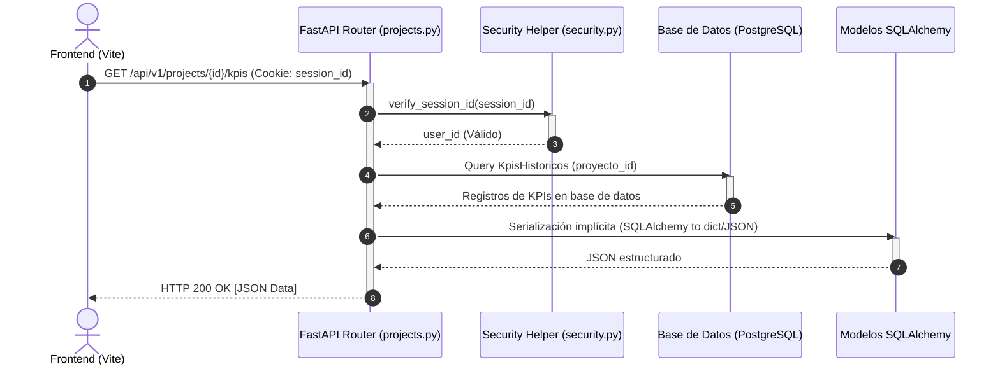
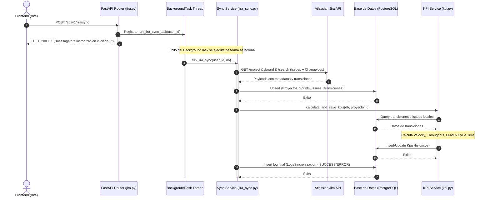

# Documentación Técnica del Backend - MCHAV-ANALYTICS
**Arquitectura, Flujo de Datos y Mapa de Componentes**  
*Autor: Arquitecto de Software Senior & Technical Writer*  
*Fecha: Julio 2026*  
*Versión: 1.0.0*

---

## 1. Arquitectura General del Backend

El backend de **MCHAV-ANALYTICS** está construido sobre **FastAPI**, un framework moderno, rápido (de alto rendimiento) para la creación de APIs en Python, utilizando **SQLAlchemy** como ORM (Object-Relational Mapping) y **PostgreSQL** como motor de base de datos relacional. 

El sistema sigue una arquitectura por capas desacopladas que organiza el flujo de control y de datos en la siguiente estructura unidireccional:

```
[ Cliente Frontend ] (Vite / React)
       │ (HTTP Requests / Session Cookies)
       ▼
 ┌──────────┐
 │  Routers │  Exponen los endpoints REST (API v1) y validan sesiones mediante HMAC.
 └─────┬────┘
       │ (Llamadas a funciones de servicios con sesión DB)
       ▼
 ┌──────────┐
 │ Servicios│  Contienen las reglas de negocio, lógica de sincronización con Jira y
 └─────┬────┘  motores de cálculo analítico (KPIs).
       │ (Queries a través de SQLAlchemy ORM)
       ▼
 ┌──────────┐
 │ Modelos  │  Definición de entidades (Base SQLAlchemy) que mapean
 └─────┬────┘  las tablas relacionales de la Base de Datos.
       │ (SQL nativo gestionado por driver psycopg2)
       ▼
 ┌──────────┐
 │    DB    │  Almacenamiento persistente en PostgreSQL 14+.
 └──────────┘
```

### Flujo de Información Macro

1. **Autenticación e Inicio de Sesión**:
   - El usuario solicita el inicio de sesión vía OAuth 2.0 de Atlassian (`/api/v1/auth/login`).
   - Tras conceder permisos, Jira redirige al endpoint `/api/v1/auth/callback`. El backend intercambia el código por tokens de acceso/refresco, recupera el perfil del usuario (accountId, email, displayName, cloudId) y almacena/actualiza la entidad `User` en PostgreSQL.
   - Se emite una cookie segura firmada con HMAC (`session_id`) que viaja con cada petición posterior.

2. **Ingesta de Datos (Sincronización manual / Webhooks)**:
   - **Sincronización Completa**: Se inicia mediante una petición POST al endpoint `/api/v1/jira/sync`. El endpoint delega la tarea en segundo plano mediante `BackgroundTasks` de FastAPI, permitiendo responder inmediatamente al cliente. El proceso descarga proyectos, sprints de Scrum, issues y sus historiales de transiciones desde la REST API de Jira, persistiendo todo en la base de datos.
   - **Sincronización en Tiempo Real**: Jira notifica cambios de estado en issues mediante Webhooks configurados hacia el endpoint `/api/v1/jira/webhook`. El backend procesa el payload JSON de forma síncrona, actualizando la entidad `Issue`, recalculando su historial de transiciones y gatillando inmediatamente la actualización de los KPIs.

3. **Cálculo de KPIs Analíticos**:
   - Tras cualquier sincronización (completa o vía webhook), el motor en `app/services/kpi.py` analiza el conjunto de datos de issues y transiciones de estado para calcular métricas ágiles esenciales (*Velocity*, *Throughput*, *Lead Time*, *Cycle Time*) y almacena registros históricos en la tabla `kpis_historicos`.

4. **Consumo de Analíticas**:
   - El frontend solicita los KPIs históricos para un proyecto o sprint específico a través de endpoints en `/api/v1/projects/{proyecto_id}/kpis`. El router consulta a la base de datos a través de SQLAlchemy y retorna la información en formato JSON.

---

## 2. Mapa de Rutas de Archivos y Responsabilidades

A continuación se detalla la estructura física del backend en el directorio `backend/` (mapeado localmente como `Mchav-Backend/`), describiendo la responsabilidad de cada archivo y sus componentes clave.

### `app/main.py`
* **Ruta exacta**: [app/main.py](file:///c:/Users/msalamanca/Desktop/Proyecto Mchav/Mchav-Backend/app/main.py)
* **Propósito principal**: Punto de entrada de la aplicación FastAPI. Inicializa la aplicación, configura el middleware de CORS y monta el router global de la API. Adicionalmente, ejecuta de forma síncrona la creación de tablas en la base de datos al arrancar si estas no existen.
* **Módulos y funciones clave**:
  - `app = FastAPI(...)`: Instancia principal de la aplicación.
  - `models.Base.metadata.create_all(bind=engine)`: Crea automáticamente las tablas mapeadas en los modelos SQLAlchemy.
  - `read_root()`: Endpoint raíz GET `/` que funciona como un Health Check básico de la aplicación.

### `app/models/` (Paquete de Modelos Modulares)
* **Ruta exacta**: [app/models/](file:///c:/Users/msalamanca/Desktop/Proyecto Mchav/Mchav-Backend/app/models/)
* **Propósito principal**: Define la estructura de datos relacional utilizando la API declarativa de SQLAlchemy. Recientemente refactorizado en múltiples dominios de negocio y orquestado mediante el **Patrón Fachada** en el `__init__.py`.
* **Archivos y dominios clave**:
  - `__init__.py`: Importa y re-exporta todos los modelos, permitiendo que el resto del sistema haga `import app.models as models` sin romper dependencias.
  - `auth.py`: **Dominio de Identidad**. Contiene `User` y `Role` para el control de acceso y gestión de sesiones OAuth2.
  - `jira.py`: **Dominio Ágil**. Contiene `Proyecto`, `Sprint`, `Issue`, `TransicionEstadoIssue`, `MapeoEstado` y la tabla intermedia `issues_sprints`. Mapea toda la lógica transaccional traída desde Atlassian.
  - `metrics.py`: **Dominio Estadístico**. Contiene `KpisHistoricos` (almacén de métricas calculadas) y `LogsSincronizacion` (auditoría de jobs en segundo plano).

### `app/core/config.py`
* **Ruta exacta**: [app/core/config.py](file:///c:/Users/msalamanca/Desktop/Proyecto Mchav/Mchav-Backend/app/core/config.py)
* **Propósito principal**: Carga y centraliza las variables de entorno de la aplicación a través de `dotenv`, proporcionando una interfaz limpia para consumir credenciales de API de Jira y URLs de conexión.
* **Módulos y funciones clave**:
  - `load_dotenv(override=True)`: Carga el archivo `.env` sobrescribiendo valores previos.
  - Constantes exportadas: `CLIENT_ID`, `CLIENT_SECRET`, `CALLBACK_URL`, `SESSION_SECRET_KEY`, `FRONTEND_URL`, `DATABASE_URL`.

### `app/core/database.py`
* **Ruta exacta**: [app/core/database.py](file:///c:/Users/msalamanca/Desktop/Proyecto Mchav/Mchav-Backend/app/core/database.py)
* **Propósito principal**: Establece la conexión a la base de datos PostgreSQL, configura el generador de sesiones transaccionales y proporciona una función generadora dependiente para inyectar la sesión en los endpoints de FastAPI.
* **Módulos y funciones clave**:
  - `engine = create_engine(DATABASE_URL)`: Gestor de la conexión física y pool de conexiones.
  - `SessionLocal`: Fábrica de sesiones para interactuar con la DB.
  - `get_db()`: Generador (`yield`) que inicializa una sesión de base de datos y garantiza su cierre seguro (`db.close()`) en un bloque `finally` para evitar fugas de conexiones.

### `app/core/security.py`
* **Ruta exacta**: [app/core/security.py](file:///c:/Users/msalamanca/Desktop/Proyecto Mchav/Mchav-Backend/app/core/security.py)
* **Propósito principal**: Provee utilidades criptográficas para asegurar las sesiones de usuario mediante firmas digitales HMAC (Hash-based Message Authentication Code) con algoritmo SHA256. Esto evita la manipulación del `user_id` almacenado en las cookies.
* **Módulos y funciones clave**:
  - `sign_session_id(user_id: int) -> str`: Genera una cadena formateada como `{user_id}.{firma}` donde la firma es un hash hmac único generado con el `SESSION_SECRET_KEY` del sistema.
  - `verify_session_id(signed_value: str) -> int | None`: Descompone el valor firmado, recalcula la firma esperada y utiliza `hmac.compare_digest` para mitigar ataques de canal lateral (timing attacks). Retorna el entero `user_id` si es válido, de lo contrario `None`.

### `app/api/v1/api.py`
* **Ruta exacta**: [app/api/v1/api.py](file:///c:/Users/msalamanca/Desktop/Proyecto Mchav/Mchav-Backend/app/api/v1/api.py)
* **Propósito principal**: Centraliza e integra los sub-routers de la API versión 1 bajo un enrutador unificado (`api_router`), asignándoles prefijos de ruta y etiquetas Swagger para la autogeneración de documentación.
* **Módulos y funciones clave**:
  - `api_router.include_router(auth.router, prefix="/auth")`
  - `api_router.include_router(jira.router, prefix="/jira")`
  - `api_router.include_router(projects.router, prefix="/projects")`

### `app/api/v1/endpoints/auth.py`
* **Ruta exacta**: [app/api/v1/endpoints/auth.py](file:///c:/Users/msalamanca/Desktop/Proyecto Mchav/Mchav-Backend/app/api/v1/endpoints/auth.py)
* **Propósito principal**: Gestiona el ciclo de vida de la autenticación de usuarios mediante el flujo OAuth 2.0 de Atlassian. Emite y destruye cookies de sesión.
* **Módulos y funciones clave**:
  - `get_current_user(...)`: Endpoint `/me`. Valida la cookie `session_id`, extrae la sesión y retorna la información del usuario autenticado actual y su rol asignado.
  - `login()`: Endpoint `/login`. Genera un token aleatorio contra falsificación de peticiones en sitios cruzados (CSRF) guardado en `oauth_states`, construye la URI de autorización de Atlassian y redirige al usuario.
  - `callback(...)`: Endpoint `/callback`. Recibe el código de autorización temporal, valida el estado (CSRF), realiza una petición POST hacia Atlassian para obtener el *access_token* y *refresh_token*, consulta `/myself` para obtener datos de perfil del usuario, crea o actualiza el usuario en la base de datos y emite una cookie firmada con HttpOnly.

### `app/api/v1/endpoints/jira.py`
* **Ruta exacta**: [app/api/v1/endpoints/jira.py](file:///c:/Users/msalamanca/Desktop/Proyecto Mchav/Mchav-Backend/app/api/v1/endpoints/jira.py)
* **Propósito principal**: Expone endpoints relacionados con Jira, incluyendo estadísticas rápidas de la API, inicio de sincronización en segundo plano, auditoría de logs y el webhook receptor de actualizaciones de Jira.
* **Módulos y funciones clave**:
  - `get_jira_metrics(...)`: Endpoint `/metrics`. Realiza 4 consultas asíncronas en paralelo vía HTTP (usando `asyncio.gather` y `httpx`) directamente a la API de Jira para obtener datos en tiempo real de proyectos y tickets resueltos, en progreso y bugs críticos.
  - `trigger_jira_sync(...)`: Endpoint `/sync`. Dispara una sincronización de datos completa ejecutada de manera asíncrona mediante un `BackgroundTasks` de FastAPI, permitiendo que la API retorne éxito inmediato mientras el worker procesa en segundo plano.
  - `get_sync_logs(...)`: Endpoint `/sync/logs`. Retorna los últimos 20 registros históricos de sincronizaciones realizadas.
  - `jira_webhook(...)`: Endpoint `/webhook`. Expuesto para recibir payloads del webhook de Jira en tiempo real. Analiza los campos del ticket, mapea relaciones muchos a muchos con sprints, regenera el historial de transiciones de estado a partir de los registros de cambios (`changelog`) y recalcula los KPIs del proyecto automáticamente.

### `app/api/v1/endpoints/projects.py`
* **Ruta exacta**: [app/api/v1/endpoints/projects.py](file:///c:/Users/msalamanca/Desktop/Proyecto Mchav/Mchav-Backend/app/api/v1/endpoints/projects.py)
* **Propósito principal**: Gestiona endpoints asociados a la consulta de información persistida a nivel de proyectos, sprints, KPIs históricos y mapeos de estados ágiles personalizados.
* **Módulos y funciones clave**:
  - `get_projects(...)`: Endpoint `/`. Recupera todos los proyectos importados.
  - `get_project_kpis(...)`: Endpoint `/{proyecto_id}/kpis`. Retorna la serie temporal de KPIs calculados históricos para un proyecto determinado, opcionalmente filtrados por sprint.
  - `get_project_sprints(...)`: Endpoint `/{proyecto_id}/sprints`. Retorna los sprints asociados a un proyecto.
  - `get_project_unique_statuses(...)`: Endpoint `/{proyecto_id}/statuses`. Analiza de forma exhaustiva los estados actuales de los tickets y todos los estados registrados en el historial de transiciones de un proyecto, retornando una lista ordenada de estados únicos para facilitar la parametrización en el frontend.
  - `get_project_mappings(...)` y `save_project_mappings(...)`: Endpoints GET y POST para gestionar cómo se relacionan los estados nativos de Jira con el flujo analítico interno ("IN_PROGRESS", etc.). Al guardar un nuevo mapeo, se ejecuta de inmediato el recálculo de los KPIs históricos.

### `app/services/jira_sync.py`
* **Ruta exacta**: [app/services/jira_sync.py](file:///c:/Users/msalamanca/Desktop/Proyecto Mchav/Mchav-Backend/app/services/jira_sync.py)
* **Propósito principal**: Contiene el motor de sincronización asíncrono para volcar masivamente los datos desde Jira Cloud hacia PostgreSQL. Ejecuta llamadas HTTP recursivas (paginadas) y gestiona la renovación automática de tokens de acceso expirados (OAuth 2.0 Refresh Flow).
* **Módulos y funciones clave**:
  - `refresh_user_token(...)`: Solicita un nuevo `access_token` a Atlassian usando el `refresh_token` almacenado cuando se recibe un error 401 (no autorizado).
  - `jira_request(...)`: Wrapper genérico para peticiones HTTP que intercepta errores 401 y transparentemente refresca las credenciales antes de reintentar la operación.
  - `get_jira_field_mappings(...)`: Inspecciona dinámicamente la definición de campos en el sitio de Jira para identificar los identificadores dinámicos asignados a campos especiales (generalmente del plugin Greenhopper como `customfield_XXXXX` para Sprints e Historias de Usuario / Story Points).
  - `sync_projects(...)`: Consulta y persiste los metadatos de los proyectos accesibles.
  - `sync_sprints(...)`: Descubre los Agile Boards del sitio de Jira, filtra por tableros de Scrum y extrae todos los sprints (fechas de inicio, fin, finalización y estado) asociándolos a proyectos locales.
  - `sync_issues_and_transitions(...)`: Realiza búsquedas paginadas mediante JQL por proyecto. Extrae detalles de issues, calcula e inserta relaciones muchos a muchos con sprints, limpia e inserta cronológicamente los historiales de cambios de estado (`changelog` a `TransicionEstadoIssue`).
  - `run_jira_sync(...)`: Orquestador principal que ejecuta secuencialmente los sub-procesos de sincronización y registra la auditoría final en `LogsSincronizacion`.

### `app/services/kpi.py`
* **Ruta exacta**: [app/services/kpi.py](file:///c:/Users/msalamanca/Desktop/Proyecto Mchav/Mchav-Backend/app/services/kpi.py)
* **Propósito principal**: Motor matemático encargado de procesar el volumen de datos históricos en base de datos para calcular las métricas de rendimiento y eficiencia de proyectos y sprints.
* **Módulos y funciones clave**:
  - `get_issue_cycle_time_days(...)`: Calcula la duración del ciclo de desarrollo de una tarea en días decimales. Inspecciona el orden temporal de las transiciones del ticket buscando la primera transición hacia un estado mapeado como "IN_PROGRESS". Si no la encuentra, asume como fecha de inicio de trabajo la fecha de creación del ticket.
  - `calculate_and_save_kpis(...)`: Orquestador que calcula y almacena/actualiza KPIs agregados. Procesa las métricas a nivel global del proyecto (donde `id_sprint` es `NULL`) y también a nivel granular para cada sprint del proyecto de forma individual.

---

## 3. Detalle de Capas Técnicas

### Lógica de Rutas y Middleware de Seguridad
FastAPI utiliza inyección de dependencias para validar sesiones de usuario. El archivo `app/api/v1/endpoints/projects.py` y `jira.py` definen dos funciones de asistencia:
1. `get_current_user_id(request: Request) -> int`: Lee la cookie firmada `session_id`. Llama a `verify_session_id` de `app/core/security.py` para corroborar criptográficamente mediante HMAC que la sesión no ha sido falsificada y devuelve el `user_id` descifrado. Si la firma es incorrecta o la cookie no existe, lanza un error HTTP 401.
2. `check_user_exists(db: Session, user_id: int)`: Corrobora que el ID del usuario exista físicamente en la base de datos.

Ejemplo del flujo de inyección en endpoints:
```python
@router.get("")
async def get_projects(request: Request, db: Session = Depends(get_db)):
    user_id = get_current_user_id(request)
    check_user_exists(db, user_id)
    
    projects = db.query(models.Proyecto).all()
    return projects
```

### Lógica de Cálculo de KPIs Ágiles (`app/services/kpi.py`)

El backend calcula cuatro métricas analíticas fundamentales. Su lógica detallada es:

1. **Velocity (Velocidad)**:
   - *Definición*: Suma acumulada de puntos de historia (*Story Points*) completados.
   - *Lógica de cálculo*: Para un sprint cerrado o proyecto general, filtra los tickets correspondientes cuyo atributo `resolved_at` no sea nulo. Suma el campo numérico `story_points` de todos los tickets resueltos:
     $$\text{Velocity} = \sum \text{story\_points}_{\text{tickets resueltos}}$$
   - *Velocidad Promedio Histórica*: Para un sprint $N$, calcula la media móvil de las velocidades obtenidas en los sprints cerrados previos y actuales del proyecto.

2. **Throughput (Rendimiento)**:
   - *Definición*: Cantidad total de tickets completados en un intervalo o sprint.
   - *Lógica de cálculo*: Es la cuenta entera pura del volumen de tickets resueltos (`resolved_at is not None`) en el scope:
     $$\text{Throughput} = \text{Count}(\text{issues resueltos})$$

3. **Lead Time (Tiempo de Entrega)**:
   - *Definición*: Tiempo total transcurrido desde la creación del ticket hasta su resolución formal en Jira.
   - *Lógica de cálculo*: Para cada ticket resuelto, calcula la diferencia temporal en días exactos:
     $$\text{Lead Time} = \frac{\text{resolved\_at} - \text{created\_at}}{86400 \text{ segundos}}$$
     La métrica del sprint o proyecto se obtiene mediante el promedio aritmético simple de los Lead Times individuales de sus tickets resueltos.

4. **Cycle Time (Tiempo de Ciclo)**:
   - *Definición*: Tiempo activo que toma completar la tarea una vez que el desarrollo ha iniciado.
   - *Lógica de cálculo*: 
     - Recupera los mapeos de estados del proyecto (`MapeoEstado`) cuyo `estado_base` es `"IN_PROGRESS"`.
     - Inspecciona la tabla `transiciones_estado_issue` ordenada cronológicamente por `fecha_cambio`.
     - Identifica la fecha del primer movimiento de estado en el cual `estado_nuevo` coincida con algún estado de progreso definido en los mapeos.
     - Si existe esa transición de inicio de desarrollo:
       $$\text{Cycle Time} = \frac{\text{resolved\_at} - \text{fecha\_primer\_progreso}}{86400 \text{ segundos}}$$
     - Si no se encuentra registro de que el ticket haya transitado por un estado de progreso (por ejemplo, tickets creados y resueltos directamente sin fases intermedias o con historiales incompletos), se realiza un *fallback* seguro usando la fecha de creación:
       $$\text{Cycle Time} = \frac{\text{resolved\_at} - \text{created\_at}}{86400 \text{ segundos}}$$
     - Se calcula el promedio aritmético simple de los Cycle Times de todos los tickets resueltos del proyecto/sprint.

### Estructura de Modelos y Esquemas
La capa de persistencia está acoplada directamente a SQLAlchemy. Los modelos fundamentales en `app/models.py` definen las siguientes relaciones:
- Un **`Proyecto`** tiene una relación de uno a muchos con **`Sprint`** y **`Issue`**.
- Un **`Sprint`** puede albergar múltiples **`Issue`** como `sprint_activo`, pero a su vez un ticket puede pertenecer a varios sprints a lo largo de su ciclo de vida (relación muchos a muchos modelada con la tabla de unión `issues_sprints`).
- Un **`Issue`** posee una relación de uno a muchos con **`TransicionEstadoIssue`**, permitiendo rastrear el histórico completo de cambios de estado.
- Un **`Proyecto`** posee múltiples registros de **`MapeoEstado`** para parametrizar las equivalencias de estados de Jira.

> [!WARNING]
> **Falta de Esquemas Pydantic**: 
> A pesar de que `pydantic` se encuentra listado en el archivo de dependencias `requirements.txt`, no hay esquemas Pydantic (`BaseModel`) implementados en el código python del backend para la validación y serialización de los payloads. Los endpoints aceptan entradas dinámicas como `list[dict]` u objetos JSON crudos y devuelven modelos SQLAlchemy directos. Esto representa un área de riesgo para la mantenibilidad (ver sección 5).

### Sincronización Incremental Nocturna en Segundo Plano
* **Implementación actual**: 
  - La lógica de sincronización completa radica en `app/services/jira_sync.py` (`run_jira_sync_task` y `run_jira_sync`).
  - No existe un motor interno de tareas cron programadas (como Celery Beat o APScheduler) configurado en el código base.
  - La sincronización asíncrona es **bajo demanda**, gatillada a nivel de API llamando a `POST /api/v1/jira/sync`.

* **Solución de Sincronización Nocturna**:
  Para cumplir con una sincronización incremental nocturna en producción, el sistema está diseñado para integrarse externamente (ej. un cronjob del sistema operativo, AWS CloudWatch Events o Google Cloud Scheduler) llamando periódicamente al endpoint `/api/v1/jira/sync` usando autenticación o programando un script alternativo en el despliegue Docker que invoque `run_jira_sync_task` directamente.

---

## 4. Diagrama de Interacción de Componentes

### Flujo de Consulta de KPIs (GET Request)
Muestra la secuencia de interacción desde que llega una petición HTTP GET para obtener las analíticas hasta que el JSON es retornado.



### Flujo de Sincronización Manual (Background Execution)
Muestra cómo se desencadena la descarga asíncrona de datos desde Jira y la actualización automática de KPIs.



---

## 5. Puntos Críticos de Mantenibilidad (RNF-015)

El Requerimiento No Funcional **RNF-015 (Mantenibilidad)** exige un sistema estructurado de forma modular y con un bajo acoplamiento que facilite la corrección de errores, la extensión de funcionalidades y la legibilidad. Durante el análisis del backend, se han identificado las siguientes áreas críticas y oportunidades de mejora:

### 1. Ausencia de Esquemas de Validación y Respuesta (Pydantic)
* **Estado actual**: Los routers procesan directamente diccionarios dinámicos y exponen los modelos declarativos de SQLAlchemy.
* **Problema**: 
  - **Falta de Validación**: No se validan los tipos de datos entrantes en peticiones POST (como en `/mappings`), lo que puede resultar en excepciones no controladas o en inserciones corruptas de base de datos.
  - **Falta de Contratos Estrictos**: Los endpoints retornan objetos de base de datos completos. Si se realiza una consulta externa a los endpoints, no existe un contrato estricto de salida, lo que genera problemas de serialización en objetos con relaciones complejas o circulares.
  - **Documentación deficiente**: OpenAPI (Swagger) no puede generar documentación interactiva detallada de las propiedades de entrada/salida.
* **Recomendación**: Crear un módulo `app/schemas.py` o un directorio `app/schemas/` y migrar todos los endpoints para que utilicen Pydantic `BaseModel` para validación y serialización (`response_model`).

### 2. Acoplamiento Directo de Operaciones de DB en los Endpoints
* **Estado actual**: Se ejecutan llamadas directas a `db.query(models.Entity)` dentro de los archivos de rutas de API (ej: `auth.py`, `projects.py`, `jira.py`).
* **Problema**: Las rutas de API tienen la responsabilidad de gestionar las peticiones HTTP y a su vez conocen detalles internos de cómo se estructuran las consultas SQL en SQLAlchemy. Esto dificulta la posibilidad de cambiar la tecnología de base de datos o el ORM, y complica la redacción de pruebas unitarias.
* **Recomendación**: Implementar el patrón **Repository** o crear una capa intermedio de CRUD/Controladores. Las rutas deben invocar servicios y los servicios deben interactuar con capas de abstracción de datos especializadas.

### 3. Lógica por Defecto Hardcoded en el Cálculo de KPIs
* **Estado actual**: En `app/services/kpi.py`, los estados de Jira por defecto considerados como "en desarrollo" para calcular el *Cycle Time* se definen mediante un set estático dentro de la función:
  ```python
  in_progress_statuses = {"in progress", "en progreso", "desarrollo", "in development", "doing", "active", "en desarrollo"}
  ```
* **Problema**: Cualquier cambio en los valores de fallback del negocio requerirá modificar directamente el archivo de lógica del servicio, violando el principio Open/Closed.
* **Recomendación**: Centralizar estas constantes en `app/core/config.py` o persistir un mapeo predeterminado global en la base de datos a través de una migración inicial.

### 4. Uso de `BackgroundTasks` para Procesos de Larga Duración
* **Estado actual**: El proceso `/sync` utiliza las tareas en segundo plano nativas de FastAPI, las cuales se ejecutan en hilos dentro del mismo proceso del servidor web Uvicorn.
* **Problema**: Si el servidor web se reinicia o se cae debido a un fallo inesperado o un proceso de despliegue continuo, las tareas de sincronización activas se interrumpirán abruptamente, pudiendo dejar la base de datos en un estado inconsistente y perdiéndose la auditoría en `LogsSincronizacion`. Adicionalmente, este modelo no escala horizontalmente.
* **Recomendación**: Para producción y alta mantenibilidad en sistemas de gran escala, migrar estas tareas a una cola de mensajes distribuida utilizando **Celery** con **Redis** o **RabbitMQ** como brokers, aislando el tráfico web del procesamiento de datos en segundo plano.
